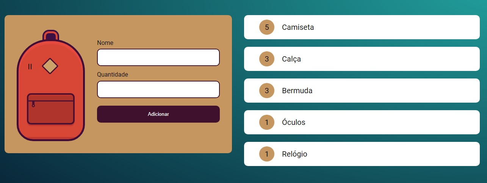

<h1 align="center"> Mochila de viagem </h1>

Mochila de viagem é um projeto desenvolvido pela alura  
para o curso de front-end "Armazenando dados na web"

  <a href="#-tecnologias">Tecnologias</a>&nbsp;&nbsp;&nbsp;|&nbsp;&nbsp;&nbsp;
  <a href="#-projeto">Projeto</a>&nbsp;&nbsp;&nbsp;|&nbsp;&nbsp;&nbsp;
  <a href="#-layout">Layout</a>

 

  

## 🚀 Tecnologias

Esse projeto foi desenvolvido com as seguintes tecnologias:

- HTML e CSS
- JavaScript
- Git e Github

## 💻 Projeto

Mochila de viagem foi um projeto desenvolvido pela alura para ensinar como salvar informações do usuário principalmente utilizando o localStorage.

- [Visite o projeto online](https://danielcaresma.github.io/mochila-de-viagem)

## 🔖 Layout

Para facilitar o aprendizado a alura disponibilizou um projeto base com o HTML e CSS já criados.  
Para acessar o projeto base [Clique aqui](https://github.com/alura-cursos/js_localStorage)